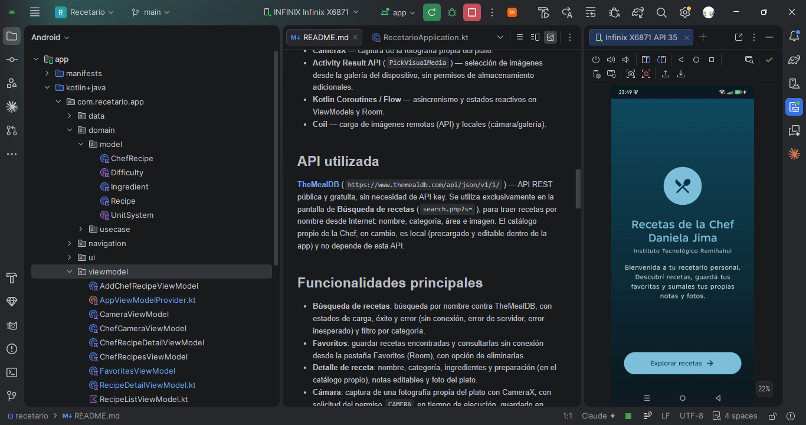
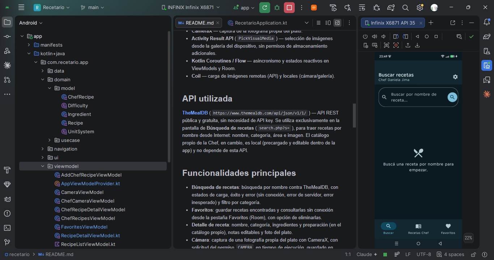
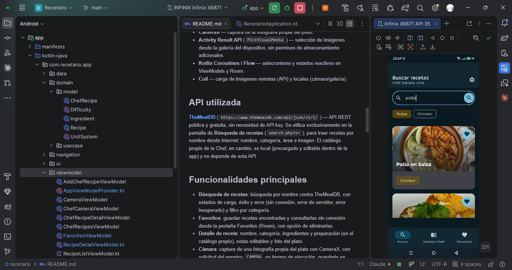
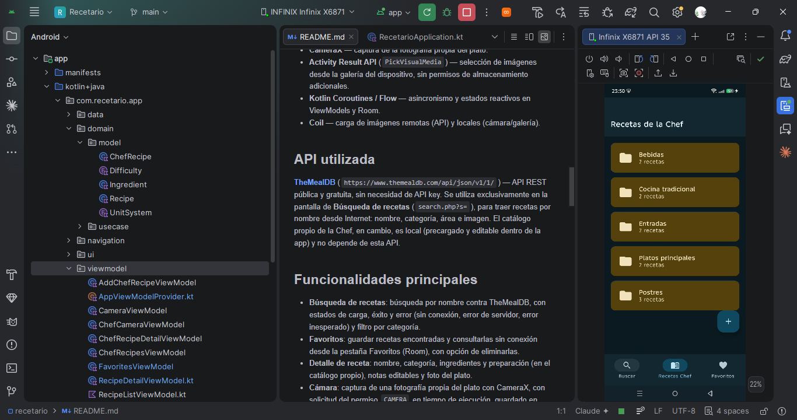
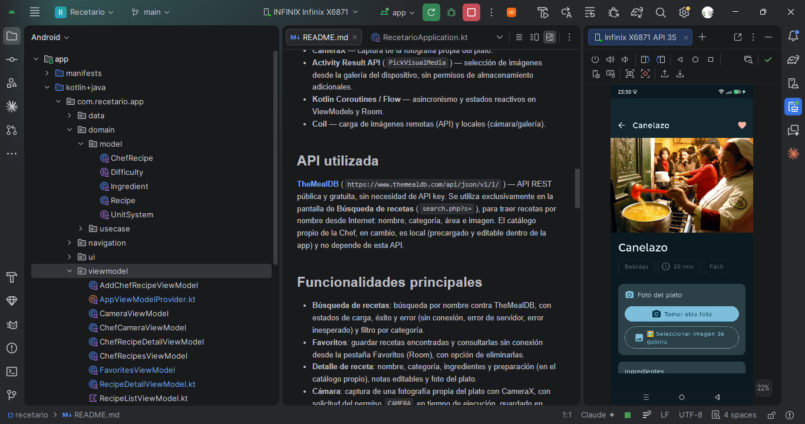
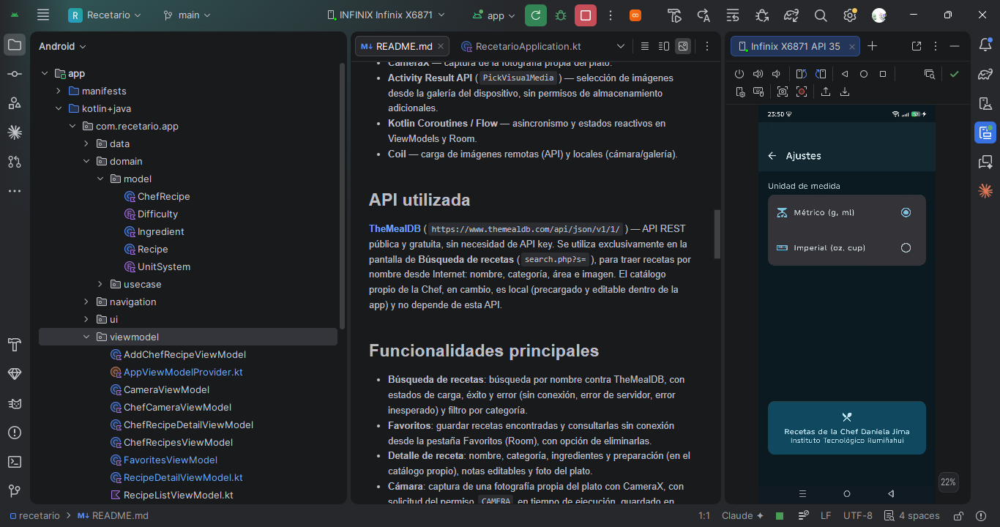

# Recetario

Proyecto final individual — Asignatura de Aplicaciones Móviles — **Instituto
Tecnológico Rumiñahui**.

## Descripción

**Recetario** (en la app, "Recetas de la Chef Daniela Jima") es una aplicación
Android que combina dos fuentes de recetas en una sola experiencia:

- Búsqueda de recetas públicas por nombre contra la API **TheMealDB**, con
  posibilidad de guardarlas como favoritas para consultarlas sin conexión.
- Un **catálogo propio** de recetas de la Chef Daniela Jima, precargado dentro
  de la app y organizado por categorías (Entradas, Platos principales,
  Postres, Bebidas, Cocina tradicional), al que el usuario puede sumar sus
  propias recetas.

En ambos casos, el usuario puede anotar notas propias, tomar una fotografía
del plato con la cámara o elegir una imagen de la galería, y marcar recetas
como favoritas.

## Objetivo

Aplicar en un proyecto completo los conceptos centrales de desarrollo Android
moderno: interfaz declarativa con Jetpack Compose, arquitectura MVVM +
Repository con separación en capas, persistencia local, consumo de una API
REST, uso de funciones de hardware del dispositivo (cámara y galería), y
publicación de builds firmadas (APK y AAB) listas para distribución.

## Arquitectura

MVVM + patrón Repository, con separación estricta en capas `ui` (Compose) /
`viewmodel` / `domain` / `data`. La UI solo conoce modelos de `domain`, nunca
entidades de Room ni DTOs de la API; cada ViewModel depende únicamente de
casos de uso (`domain/usecase`), y estos dependen de los repositorios en
`data`, que son el único punto de acceso a Room, Retrofit y DataStore.

```
ui/
 ├── theme        → Color, Theme, Type (identidad visual en tonos azules)
 ├── screens      → SplashScreen, HomeScreen, RecipeListScreen, FavoritesScreen,
 │                  RecipeDetailScreen, CameraScreen, SettingsScreen,
 │                  ChefRecipesScreen, ChefRecipeDetailScreen, AddChefRecipeScreen
 └── components   → RecetarioBottomBar, RecipeCard, ChefRecipeCard, CategoryFolderCard

viewmodel/        → RecipeListViewModel, FavoritesViewModel, RecipeDetailViewModel,
                     CameraViewModel, SettingsViewModel, ChefRecipesViewModel,
                     ChefRecipeDetailViewModel, AddChefRecipeViewModel,
                     ChefCameraViewModel
                     (exponen StateFlow, nunca acceden a Retrofit/Room/DataStore
                     directamente)

domain/
 ├── model        → Recipe, UnitSystem, ChefRecipe, Ingredient, Difficulty
 └── usecase      → GetSavedRecipesUseCase, SearchRecipesUseCase,
                     AddToFavoritesUseCase, SaveRecipeUseCase, DeleteRecipeUseCase,
                     GetRecipeByIdUseCase, GetUnitSystemUseCase, SetUnitSystemUseCase,
                     GetChefRecipesUseCase, GetChefRecipeByIdUseCase,
                     AddChefRecipeUseCase, ToggleChefRecipeFavoriteUseCase,
                     SeedChefRecipesUseCase

data/
 ├── local        → RecipeEntity, RecipeDao, ChefRecipeEntity, ChefRecipeDao,
 │                  AppDatabase (Room, con migración v1→v2)
 ├── remote       → MealApiService, MealDto, MealsResponseDto, RetrofitInstance,
 │                  MealMapper (TheMealDB)
 ├── repository   → RecipeRepository, ChefRecipeRepository, ChefRecipeSeedData,
 │                  UserPreferencesRepository
 └── datastore    → UserPreferencesDataStore (unidad de medida)
```

## Tecnologías utilizadas

- **Kotlin** — lenguaje principal del proyecto.
- **Jetpack Compose** — UI declarativa (Material 3, Navigation Compose con
  transiciones y bottom bar de 3 pestañas).
- **Room** — persistencia local de recetas favoritas y del catálogo propio
  (notas, foto y favoritos).
- **DataStore (Preferences)** — preferencias de usuario (unidad métrica/imperial).
- **Retrofit + OkHttp + Gson** — consumo de la API REST, con logging
  interceptor. Gson también se reutiliza para serializar listas
  (ingredientes/pasos) en Room.
- **CameraX** — captura de la fotografía propia del plato.
- **Activity Result API** (`PickVisualMedia`) — selección de imágenes desde la
  galería del dispositivo, sin permisos de almacenamiento adicionales.
- **Kotlin Coroutines / Flow** — asincronismo y estados reactivos en
  ViewModels y Room.
- **Coil** — carga de imágenes remotas (API) y locales (cámara/galería).

## API utilizada

**[TheMealDB](https://www.themealdb.com/api.php)** (`https://www.themealdb.com/api/json/v1/1/`) —
API REST pública y gratuita, sin necesidad de API key. Se utiliza
exclusivamente en la pantalla de **Búsqueda de recetas** (`search.php?s=`),
para traer recetas por nombre desde Internet: nombre, categoría, área e
imagen. El catálogo propio de la Chef, en cambio, es local (precargado y
editable dentro de la app) y no depende de esta API.

## Funcionalidades principales

- **Búsqueda de recetas**: búsqueda por nombre contra TheMealDB, con estados
  de carga, éxito y error (sin conexión, error de servidor, error inesperado)
  y filtro por categoría.
- **Favoritos**: guardar recetas encontradas y consultarlas sin conexión desde
  la pestaña Favoritos (Room), con opción de eliminarlas.
- **Detalle de receta**: nombre, categoría, ingredientes y preparación (en el
  catálogo propio), notas editables y foto del plato.
- **Cámara**: captura de una fotografía propia del plato con CameraX, con
  solicitud del permiso `CAMERA` en tiempo de ejecución, guardado en
  almacenamiento interno de la app y persistencia de la ruta en Room.
- **Notas propias**: campo de texto libre por receta, guardado automáticamente
  en Room.
- **Preferencias de usuario**: selección de unidad de medida (métrico/imperial),
  persistida con DataStore.
- **Catálogo propio de la Chef**: recetas precargadas organizadas por
  categorías (carpetas), con ingredientes, pasos, tiempo y dificultad.
- **Agregar nueva receta**: formulario completo (nombre, categoría,
  ingredientes, preparación, tiempo, dificultad y foto desde galería),
  guardado en Room.
- **Navegación completa**: splash → bienvenida → bottom bar de 3 pestañas
  (Buscar / Recetas Chef / Favoritos), con Detalle, Cámara y Ajustes apilados.

## Cómo ejecutar el proyecto

Requisitos: Android Studio reciente, JDK 21, un dispositivo o emulador con
API 26+ (Android 8.0) y conexión a Internet (para la búsqueda de recetas).

Versiones del proyecto: Android Gradle Plugin 8.7.3, Gradle 8.10.2, Kotlin
2.0.21, `compileSdk`/`targetSdk` 35, `minSdk` 26. Gradle se ejecuta con JDK 21
(configurado en `gradle.properties`); el bytecode de la app se compila a Java
17 (`compileOptions` / `kotlinOptions` en `app/build.gradle.kts`).

1. Clonar el repositorio.
2. Abrir la carpeta del proyecto en Android Studio y esperar la sincronización
   de Gradle (o ejecutar `./gradlew build` desde la terminal).
3. Ejecutar la app en un dispositivo/emulador (▶ en Android Studio, o
   `./gradlew installDebug`).
4. Al usar la cámara o la galería por primera vez, aceptar los permisos
   solicitados.

## Información de compilación

El build de `release` firma la app usando `keystore.properties`, un archivo
local que **no se versiona** (está en `.gitignore`, junto con `*.jks` y
`*.keystore`).

1. Generar un keystore propio (una sola vez):
   ```bash
   keytool -genkeypair -v -keystore keystore/recetario-release.jks -alias recetario -keyalg RSA -keysize 2048 -validity 10000
   ```
2. Crear `keystore.properties` en la raíz del proyecto con este formato:
   ```properties
   storeFile=keystore/recetario-release.jks
   storePassword=<tu contraseña>
   keyAlias=recetario
   keyPassword=<tu contraseña>
   ```
3. Generar los paquetes firmados:
   ```bash
   ./gradlew assembleRelease   # APK firmado, para instalación directa
   ./gradlew bundleRelease     # AAB firmado, para subir a Play Store
   ```

**Salida generada:**

| Artefacto | Ubicación |
|---|---|
| APK firmado | `app/build/outputs/apk/release/app-release.apk` |
| AAB firmado | `app/build/outputs/bundle/release/app-release.aab` |
| Keystore | `keystore/recetario-release.jks` (alias `recetario`, validez 10.000 días) |

Si `keystore.properties` no existe, el build de `debug` funciona igual, pero
el de `release` queda sin firmar hasta agregarlo.

**Importante**: el keystore y sus contraseñas no deben subirse al
repositorio. Guardá una copia de respaldo del `.jks` fuera del proyecto (si se
pierde, no se pueden publicar actualizaciones futuras de la app con la misma
identidad).

## Capturas de pantalla

| Pantalla de bienvenida | Búsqueda vacía | Resultado de búsqueda |
|---|---|---|
|  |  |  |

| Catálogo Chef | Detalle receta | Ajustes |
|---|---|---|
|  |  |  |

## Diagrama de arquitectura

```
┌─────────────────────────────────────────────────────────┐
│                        UI (Compose)                      │
│  Screens (Splash, Home, Búsqueda, Favoritos, Detalle,     │
│  Cámara, Ajustes, Catálogo Chef) + Components              │
└───────────────────────────▲────────────────────────────┘
                            │ StateFlow / eventos
┌───────────────────────────┴────────────────────────────┐
│                        ViewModel                          │
│   Expone estado (Loading/Success/Error) y funciones       │
└───────────────────────────▲────────────────────────────┘
                            │ invoca
┌───────────────────────────┴────────────────────────────┐
│                     Domain (UseCases)                     │
│   Reglas de negocio puntuales, 1 acción = 1 UseCase        │
└───────────────────────────▲────────────────────────────┘
                            │ delega en
┌───────────────────────────┴────────────────────────────┐
│                      Data (Repository)                    │
│         RecipeRepository · ChefRecipeRepository            │
│              UserPreferencesRepository                     │
└──────┬─────────────────────┬─────────────────────┬──────┘
       │                     │                     │
┌──────▼──────┐     ┌────────▼────────┐   ┌────────▼────────┐
│  Room (local) │     │ Retrofit (remoto) │   │ DataStore        │
│ Recipe/Chef    │     │   TheMealDB API    │   │ (preferencias)   │
│ Entity + Dao   │     │                    │   │                  │
└───────────────┘     └────────────────────┘   └──────────────────┘
```

CameraX y la galería (Activity Result API) se integran directamente en las
pantallas de detalle/cámara: capturan o seleccionan la imagen, la copian al
almacenamiento interno de la app, y entregan la ruta al ViewModel
correspondiente, que la persiste a través del Repository — sin romper el
flujo UI → ViewModel → UseCase → Repository → Room.

## Estado del proyecto

- [x] Splash + Home + navegación completa (bottom bar de 3 pestañas).
- [x] Búsqueda contra TheMealDB, con estados Loading/Success/Error.
- [x] Favoritos y notas propias en Room.
- [x] Catálogo propio de la Chef (precargado) + formulario para agregar recetas.
- [x] Cámara (CameraX) y selección desde galería (Activity Result API), con
      permisos en tiempo de ejecución.
- [x] Preferencias de usuario con DataStore.
- [x] Identidad visual en tonos azules (modo claro y oscuro).
- [x] Capas `data` / `domain` / `viewmodel` / `ui` con patrón Repository.
- [x] APK y AAB firmados con keystore propio.
